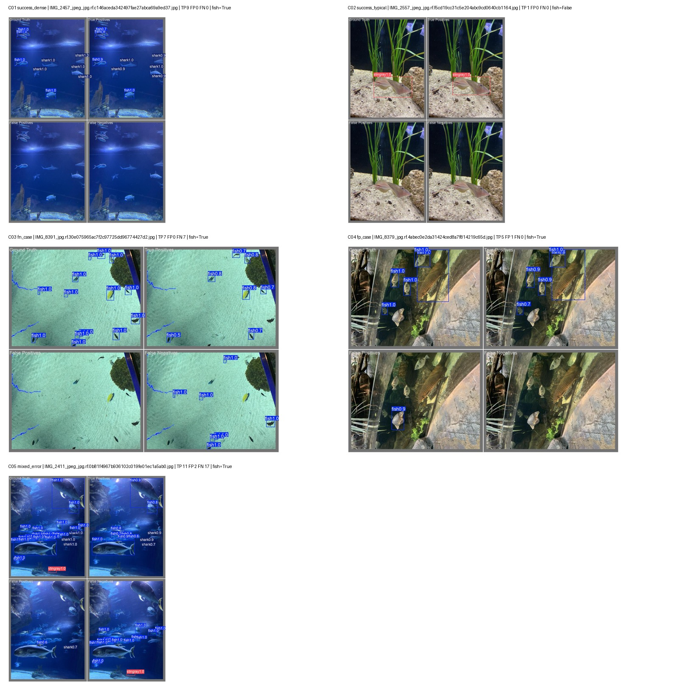

# Baseline validation error analysis

YOLO11n, `imgsz=640`, seed 42. Evidence: 127 validation images and 909 annotated objects; these are not test-set findings.

| Metric | Value |
|---|---:|
| Precision | 0.799777 |
| Recall | 0.681453 |
| mAP50 | 0.766924 |
| mAP50–95 | 0.465872 |
| Fish instances | 459 |
| Fish recall | 0.672598 |

The [validation manifest](../results/baseline/val_manifest.json) identifies the evaluated checkpoint and corrected validation run `val_best_imgsz640-2`.

## Case selection

Five cases were selected deterministically from the same validation predictions: two clean successes, one false-negative-only case, one false-positive-only case, and one mixed-error case, including at least one missed fish.

The confidence threshold came from the smoothed mean-F1 curve (`CASE_CONF=0.511512`). Prediction NMS used IoU 0.70; TP/FP/FN matching used IoU 0.50. Selection used the recorded per-image sorting rule, not visual preference. IDs and counts are retained in the [case CSV](../results/baseline/val_cases.csv) and [case manifest](../results/baseline/val_cases_manifest.json).

| Case | Image ID | TP | FP | FN | Interpretation |
|---|---|---:|---:|---:|---|
| Success | `IMG_2457_jpeg_jpg.rf.c146aceda342497fae27abca69a9ed37.jpg` | 9 | 0 | 0 | All nine fish/shark annotations matched in a moderately dense, high-contrast scene. |
| Success | `IMG_2557_jpeg_jpg.rf.f5cd19cc31c5e204abc9cd0640cb1164.jpg` | 1 | 0 | 0 | A single stingray matched against a simple background. |
| FN only | `IMG_8391_jpg.rf.30e075965ac7f2c97725dd96774427d2.jpg` | 7 | 0 | 7 | Small or low-contrast fish were missed against the pale floor. |
| FP only | `IMG_8379_jpg.rf.4abec0e2da31424ced8a7f814219c65d.jpg` | 5 | 1 | 0 | The apparent FP resembles an unlabeled fish; annotation omission or boundary ambiguity is plausible. |
| Mixed | `IMG_2411_jpeg_jpg.rf.0b81f4967b936102c019fe01ec1a5ab0.jpg` | 11 | 2 | 17 | Small targets, overlap, and crowding coincide with misses; a stingray was also missed. |

Adapted Aquarium Combined v6 images under CC BY 4.0; see [attribution](../NOTICE.md).

## Interpretation

The FN-only case contains seven missed fish, while the crowded mixed case misses 17 of 28 annotations. These examples motivate the higher-resolution hypothesis but do not prove the cause of errors or their prevalence. The apparent FP may reflect an annotation issue, so it is not conclusive evidence of a background false detection.

The cases were reviewed before test evaluation. Model selection followed the [fixed validation rule](experiment_01_plan.md), not the visual examples. Conclusions remain limited to these five cases and one training seed.
